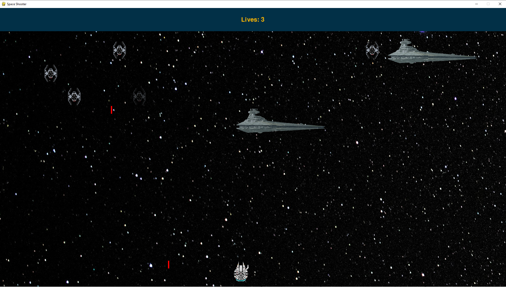
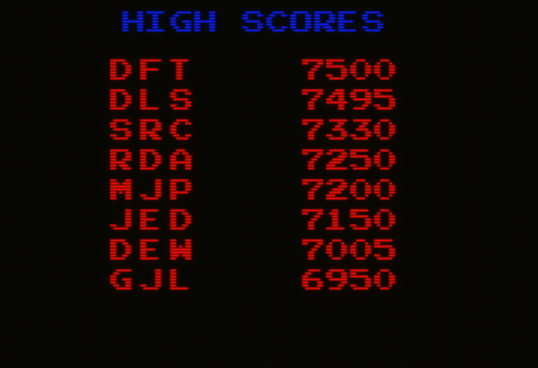

# Galactic Mayhem

Our game, _Galactic Mayhem_ is a space shooter game that is inspired from the spaceship battles from Star Wars. The player's ship, Millenium Falcon, is travelling in open space where it continiously comes across different types of enemy ships that try to exterminate it, and also asteroids that are floating accross the space. Simply, both the different types of enemy ships and players ship has a number of hitpoints, and if the player runs out of hitpoints, game ends.

## Main Element Models

The game basically consists from three main elements: Enemy ships, projectiles and player ship.

### Projectiles

Projectiles will be simple objects that span a single unit of width and a fixed unit of height, and a determined direction once created. For example, when player ship fires, a projectile with direction "u" and color blue at the top-center of the player rect will be created. And in each frame, the projectile will move. Also probably, the asteroids might be projectiles, but then they will be immune to the collisions with other projectiles. It's not clearly defined yet.

### Enemy Ships

There will be different types of enemy ships with different hitpoints and sizes, firing mechanisms. For example:

- T fighter ships will have a width of 1 units and will fire projectiles from their center.

- Star Destroyer ships on the other hand will have width of 3 units, having guns at the center, left and right edges, will be able to fire from three different parts, each having its own cooldown.

- More enemy ship classes might probably be added, most probably including a Death Star boss enemy, which itself will be able to spawn T fighters that orbit around it to protect and attack.

### Player Ship

Player ship will be the agent of the player in game, with left and right arrow keys, the player will be able to move the ship horizontally, and with the space key, ship will fire.

### Supplements

There will be random spawning of various supplements/power ups that alter the fire speed, damage and hitpoints of the user, if the user collects them, they will get various boosts. For example, if the user collects a shield object, it will gain immunity to the first projectile it interacts with. Or if the user collects a repair object, some of the hitpoints of the user will be restored.

### Dynamic Difficulty

For now, there are two possible routes for the games difficulty and scoring system, first of them is adjusting the spawn and fire probabilities of enemies, according to the current score of the player, so, more the player stays alive, harder the game gets. A second route might be having different levels, in order to pass a level, player has to eliminate a number of basic enemies and after that, an enemy boss ship with a different playstyle appears and when its exterminated, level is cleared.

### High Score Table

Highest 10 scores will be stored in a simple file or a sqlite database if its allowed in the project, so the competitive order of the arcade era will be an incentive for the players to play the game. If they get a high score, that will at least be in the top 10 of the table, player will be able to enter a name for that score.

## Contributors

- Ahmet Hakan Afşin, 2021402303
- Lütfi Furkan Şimşek, 2020402177
- Eren Yılmaz, 2022402303
